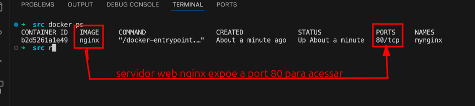
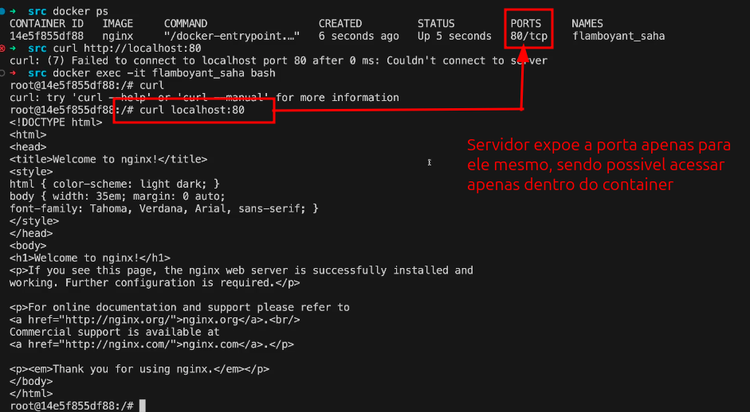

## Manipulando Containers

### 1. Executando o Primeiro Container (docker run hello-world)
Para verificar se o Docker está instalado corretamente, execute:

```
docker run hello-world
```

Este comando baixa a imagem hello-world (se ainda não estiver no seu sistema) e executa um container que exibe uma mensagem de confirmação.

### 2. Nomeando Containers e Entendendo Diferentes Execuções

* Executando um Container com um Nome Personalizado

Por padrão, o Docker atribui nomes aleatórios aos containers. Você pode especificar um nome usando a flag `--name`:

```
docker run --name mynginx nginx
```

* Executando um Container em Segundo Plano (d)

Para executar um container em modo "detached" (segundo plano), use a flag `-d`:

```
docker run -d --name mynginx nginx
```

* Mapeando Portas com a Flag p

Para mapear a porta do container para a porta do host, use `-p`:

```
docker run -d -p 8080:80 nginx
```

Isso mapeia a porta 80 do container para a porta 8080 do host.

* Dicas

Procurar comandos:

```
docker run --help | grep name
```

Procura todos os comandos que tem a palavra `name`, tanto no modulo quanto na descrição.

Quando for executar comandos com muitos parametros, para não se confundir, coloque `=`. Depois de todos os parametros coloqueo o `nome da imagem` e por fim o `comando` quando ele não tiver sido preenchido. 

```
docker run --name=mycontainer hello-world -d
``` 

### 3. Parando, Iniciando e Removendo Containers de Forma Forçada

* Listando Containers em Execução e Parados

Containers em execução:

```
docker ps
```
Todos os containers (incluindo parados):

```
docker ps -a
```

> Diferença: docker ps lista apenas os containers em execução, enquanto `docker ps -a` lista todos os containers existentes no sistema.

* Parando um Container

```
docker stop mynginx
```

* Iniciando um Container Parado

```
docker start mynginx
```

> O comando `docker run` cria um novo container, mesmo que já exista um (parado ou não) com a mesma imagem

* Removendo um Container

Remoção normal pelo nome ou pelo id:

```
docker rm mynginx
```

Remoção forçada (para containers em execução):

```
docker rm -f mynginx
```
> Diferença: `docker rm` remove apenas containers parados. \
> Para remover um container em execução, use:

``` 
docker rm -f
```

* Dicas


### 4. Attach e Detach

Conectando-se a um Container em Execução (docker attach)

```
docker attach mynginx
```

Este comando conecta seu terminal ao processo principal do container.

Saindo do Container sem Parar (CTRL + P, CTRL + Q).\
Para sair do modo attach sem parar o container, pressione CTRL + P seguido de CTRL + Q.

Para executar um Container no modo detach

``` 
docker -d mynginx
```

Dessa forma o terminal não fica 'travado' com os logs da aplicação.

### 5. Executando Comandos e Removendo Containers Automaticamente

* Executando Comandos em um Novo Container

Você pode executar um comando diretamente em um novo container:

```
docker run nginx ls -la
```

Isto executa `ls -la` no container nginx e exibe o resultado no seu terminal.

* Entrando no Container com Bash

Para acessar o shell bash dentro de um container:

```
docker run -it nginx bash
```

Isto inicia um container nginx e abre uma sessão interativa do bash.

* Diferença entre docker run e docker exec
  * `docker run`: Cria e inicia um novo container.
  * `docker exec`: Executa um comando em um container já em execução.

Exemplo com docker exec:

```
docker exec -it mynginx bash
```

Isto abre uma sessão bash em um container mynginx já em execução.

* Removendo Containers Automaticamente (`-rm`)

Para remover automaticamente um container após sua execução:

```
docker run --rm nginx ls -la
```

### 6. Removendo Todos os Containers com Subcomandos

Para remover todos os containers parados:

```
docker rm $(docker ps -a -q)
```

Explicação:

`docker ps -a -q ` lista todos os IDs de containers.
$(...) insere essa lista no comando `docker rm`.

Para remover todos os containers, incluindo os em execução, use:

```
docker rm -f $(docker ps -a -q)
```

### 7. Publicação de Portas

Caso onde a porta apenas está exposta:



> expor != publicar

Para executar um servidor **Nginx** em um container e expor uma porta local, use o comando:

```bash
docker run -d -p 8080:80 nginx
```

Agora, o Nginx estará acessível em **[http://localhost:8080](http://localhost:8080)**.

O parâmetro `-p` (de *publish*) é usado para mapear portas entre o **host** (sua máquina) e o **container**.
A sintaxe é:

```
-p <porta_do_host>:<porta_do_container>
```

No exemplo acima, a porta **8080** do seu computador está sendo redirecionada para a porta **80** do container, que é onde o Nginx escuta por padrão.
Em outras palavras: quando você acessa `http://localhost:8080`, o Docker encaminha a requisição para a porta `80` dentro do container, permitindo acessar o serviço web (Nginx) de fora dele.

> 💡 Dica: a ordem das portas importa!
> `-p 8080:80` significa **host:container**.
> Se fosse invertido (`-p 80:8080`), você tentaria acessar o container na porta 8080, mas publicando na 80 do host — o que pode causar confusão.

* Porque não colocamos `p 80:80`?

Portas com números baixos (menores que 1024) são conhecidas como portas privilegiadas.
Por questões de segurança, apenas usuários com privilégios administrativos (como o root no Linux) podem abrir essas portas diretamente. 
Por isso, ao executar containers como usuário comum, é mais seguro e prático mapear uma porta alta do host (por exemplo, 8080) para a porta padrão do serviço dentro do container (80, no caso do Nginx).


> IMPORTANTE: não utilizar containers para armazenamento de estado. Ex: salvar arquivos. Pois sempre que ele for reiniciado você perde tudo.

### 8. Execução Interativa e Acesso ao Shell

Acessando o Shell de um Container com `docker exec -it`

Se você já tem um container em execução e deseja acessar seu shell:

```
docker exec -it mynginx bash
```

* Diferença entre docker exec e docker attach
  * docker exec: Executa um novo processo dentro de um container em execução (ex.: abrir uma nova sessão bash).
  * docker attach: Anexa seu terminal ao processo principal do container (ex.: ver logs em tempo real).


### Resumo dos Comandos

Executar um container:

```
docker run [opções] imagem [comando]
```

Listar containers:

```
docker ps        # Em execução
docker ps -a     # Todos
```

Parar, iniciar e remover containers:

```
docker stop <nome|id>
docker start <nome|id>
docker rm <nome|id>
docker rm -f <nome|id>   # Forçado
```

Executar comandos em containers:

```
docker exec -it <nome|id> <comando>
```

Acessar shell bash:

```
docker exec -it <nome|id> bash
```

Remover todos os containers:

```
docker rm $(docker ps -a -q)
docker rm -f $(docker ps -a -q)   # Incluindo em execução
```